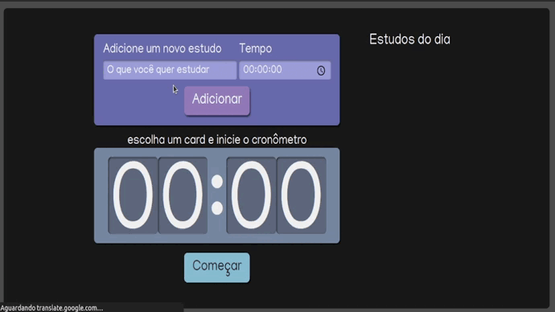

# projeto alura Studies


> # Descrição
 Uma aplicação chamada "Alura Studies", na qual poderemos adicionar as tarefas que desejamos estudar e o tempo dedicado a esses estudos. Por exemplo, vou adicionar um novo estudo "React" com o tempo de 2 segundos, e outro, "Typescript", com 5 segundos.
  Adicionando essas tarefas, elas vão para uma lista onde será possível selecioná-las. Selecionado "React", o tempo dessa tarefa vai diretamente para um cronômetro, que passará a mostrar "00:02". Se eu adicionar o Typescript, o valor mudará para "00:05". Depois que essa tarefa vai para o cronômetro, eu consigo inciá-la com o botão "Começar", que ativará o temporizador. Quando o tempo chegar a zero, a tarefa será completada e não será mais possível clicar sobre ela.


#### :thinking: Como rodar

```bash

# Clone o repositório
git clone https://github.com/MayaraRocha95/projeto-alura-studies

# Entre no diretório
cd projeto-alura-studies

# Instale as depedências
npm install

# Rode o projeto
npm start
```

Criado por Mayara Rocha